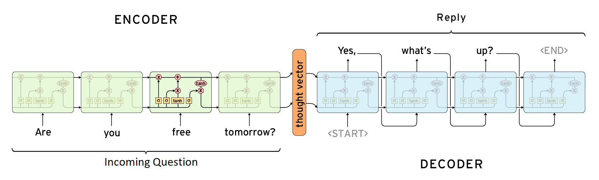

# Procesamiento de lenguaje natural

## Desafío 1: Vectorización de texto y Modelo Naïve Bayes

  

En este desafío, abordé la tarea de clasificar documentos de texto provenientes del conjunto de datos "20 Newsgroups" en diferentes categorías temáticas. Utilicé modelos de Naïve Bayes, específicamente MultinomialNB y ComplementNB, para maximizar el desempeño en términos del f1-score macro sobre un conjunto de datos de prueba.

Link(esta en el repositorio también): https://colab.research.google.com/drive/1Y5HIfl4bYYJd-bzpm30e11SOt8e1DZRg

## Desafío 2: Custom Embeddings con Gensim

  

Este desafío se centró en la creación de embeddings personalizados utilizando la biblioteca Gensim, a partir del corpus compuesto por el libro de la biblia. Primero, se realizó un preprocesamiento del texto que incluyó la tokenización y estructuración del corpus, asegurando que estuviera listo para ser utilizado en el modelo. Posteriormente, se entrenó un modelo Word2Vec para generar representaciones vectoriales de las palabras, capturando relaciones semánticas entre ellas. Finalmente, se evaluaron los embeddings mediante pruebas de analogía y se exploró su significado semántico a través de visualizaciones, permitiendo un análisis detallado de las relaciones entre las palabras representadas.

Link:  https://colab.research.google.com/drive/1VQ3DAe6R_v_RrVzaHreiCkoTQZ9kQ8m_#scrollTo=NCCXtDpcugmd

## Desafío 3: Modelo de Lenguaje con Tokenización por Palabras (Predicción proxima palabra)

  

Este desafío consistió en desarrollar un modelo de lenguaje capaz de predecir la próxima palabra, utilizando como corpus el primer libro de "Los Miserables". Se llevó a cabo un preprocesamiento que incluyó la tokenización del texto y la creación de secuencias para alimentar el modelo. Posteriormente, se exploraron diferentes arquitecturas de redes neuronales recurrentes, incluyendo SimpleRNN, LSTM y GRU, implementándolas para entrenar el modelo. Además, se aplicaron técnicas como greedy search y beam search para la generación de secuencias de texto. Finalmente, se evaluaron las arquitecturas comparando métricas como la perplejidad, lo que permitió analizar el desempeño y la calidad de las predicciones generadas.

Link: https://colab.research.google.com/drive/1Tb612His9jq6ZLmYZV7yIqAE4AaDbfze

## Desafío 4: Bot QA

  

El proyecto se centró en la construcción de un bot conversacional basado en un modelo encoder-decoder utilizando LSTM para responder preguntas. El proceso comenzó con el preprocesamiento del texto, donde se realizaron tareas como la tokenización y la creación de diccionarios para mapear palabras a índices. Se incorporaron embeddings preentrenados de FastText con 300 dimensiones para enriquecer las representaciones semánticas del modelo. A continuación, se diseñó e implementó un modelo encoder-decoder utilizando LSTM, permitiendo al bot procesar preguntas y generar respuestas coherentes. Finalmente, se evaluó el rendimiento del sistema analizando las respuestas generadas a partir de secuencias del dataset, asegurando que las interacciones fueran relevantes y precisas. También se probo utilizar un chatbot con Hugging Face.

Link: https://colab.research.google.com/drive/16u8dD6gbEK9o8KElBBUk12ywt70CTvDZ#scrollTo=m6Y-aHfmI9bS